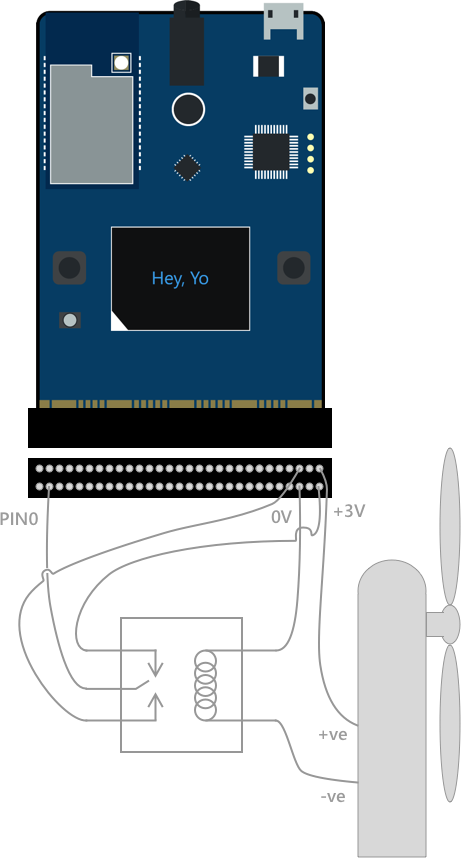
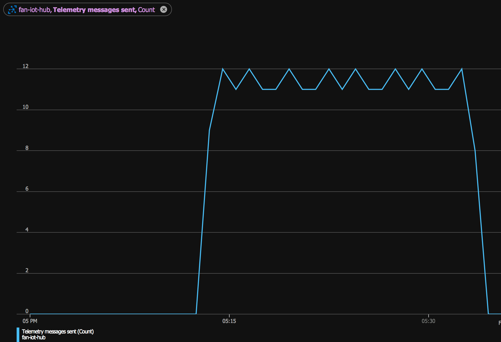

# Internet Connected Fan

This project contains all the code needed to build an internet connected fan using the [MXChip Azure IoT Dev Kit](https://microsoft.github.io/azure-iot-developer-kit/v1/) and [Azure IoT Hub](https://azure.microsoft.com/services/iot-hub/?WT.mc_id=iotfan-github-jabenn).

This project detects the current temperature, and if it is above a threshold, it will turn the fan on. It will also send telemetry data with the current temperature to an Azure IoT hub, which in turn triggers an Azure Function to save the temperature into a CosmosDB instance.

This project has a Xamarin mobile app that will poll another Azure Function to get the temperature and show it on screen. It also shows the threshold for turning on the fan, and this threshold can be configured from the app. Setting the value will call another Azure Function that updates the [device twin](https://docs.microsoft.com/azure/iot-hub/iot-hub-devguide-device-twins/?WT.mc_id=iotfan-github-jabenn) for the device - a JSON document that is kept in sync between the device and the IoT hub. When the value on the hub is updated, it syncs to the device and the temperature threshold is updated, starting the fan if necessary.

## Hardware


The hardware for this project is based around the MXChip which you can buy from [here](https://amzn.to/2Bguvem) for around £40. This is an Arduino-compatible prototyping board that comes with a range of sensors, LEDs, buttons, a screen and other capabilities, as well as connectivity to Azure IoT Hub built in.

This then needs to be attached to a relay and a fan. For the fan, I used a simple battery powered fan that works with 2 AA batteries that is available [here](https://amzn.to/2CYVQlm). I removed the batteries and connected wires instead, removing the on/off switch and running the cables through the hole. The fan runs on 3V so I was able to use power from the MXChip instead of batteries, as this board can supply 3V.

The relay I used was one that came with an Intel Edison kit, but any 3V relay will do. To make wiring easier, I used the [Inventors Kit for the BBC Micro:bit](https://amzn.to/2BgtRxs) - the MXChip has the same connector as the [Micro:bit](https://microbit.org), and this kit converts the connector to a set of GPIO pins with a built in breadboard for easy prototyping.

Power to the relay poles was wired to the 3V/0V pins on the board, with PIN0 wired to the relay control. The input to the contacts was wired to 3V from the board, with the output connected to the +ve input on the fan. Finally the -ve input on the fan was wired to the 0V connection on the board.



## Software

The software for this is in 3 parts - firmware for the device, some Azure Functions to work with device data and configure the device, and client code in the form of a mobile app.

### Pre-requisites

To build and deploy the firmware and Azure Function app you will need:

* A valid Azure account. Sign up for free [here](https://azure.com/free/?WT.mc_id=iotfan-github-jabenn) if you don't already have an account.
* [VSCode](https://code.visualstudio.com/?WT.mc_id=iotfan-github-jabenn)
* The VSCode [IoT Workbench extension](https://github.com/Microsoft/vscode-iot-workbench). This can be installed from inside VSCode.

To build and deploy the mobile app, you will need:

* [Visual Studio](https://visualstudio.microsoft.com/?WT.mc_id=iotfan-github-jabenn). This can be either Visual Studio 2017/2019 on Windows with the Xamarin workload installed, or Visual Studio for Mac.
* To deploy on iOS you will need an [Apple Developer Account](https://developer.apple.com).
* To deploy to an Android device, you will need an Android device configured for [developer mode](https://docs.microsoft.com/xamarin/android/deploy-test/debugging/debug-on-device?WT.mc_id=iotfan-github-jabenn).

### Setting up the development environment

Start by opening the `project.code-workspace` file in VSCode.

Once you have the hardware assembled, you will need to configure the MXChip with a WiFi connection, create an Azure IoT hub and register the device. To do this, follow the instructions in the [Getting Started Guide](https://microsoft.github.io/azure-iot-developer-kit/docs/get-started/) up to the **Test the project** section.

At this point, you will have an IoT hub configured, the device will be registered and and be configured with a connection string, and the code will be deployed to the device.

### Firmware

The device code is in the `Device` folder in the project, and contains a single file called `FanController.ino`. This is an Arduino sketch file - a **C** file with the code for the firmware.

Arduino code has 2 functions called automatically - `setup` and `loop`.The `setup` function is called once when the device starts up, and is a good place to initialize the device, connect to WiFi etc. After that, the `loop` function is called repeatedly to do whatever your code needs.

The `setup` function for this project initializes the WiFi, connects to the IoT hub over MQTT including setting up a callback for updates to the device twin, then initializes one of the pins, **PIN0**, to send data. This pin is used to control the relay.

The `loop` function polls the sensor for the current temperature, writing it to the screen and sending it as a message to the IoT hub over MQTT.

* If the temperature is above the threshold, a signal is sent to **PIN0** to turn on the relay and send power to the fan, starting it up. The on-board LED is also turned to red.

* If the temperature is below the threshold, the signal is stopped, turning the relay off and stopping power to the fan. The LED is set to blue. At the end of the function, it sleeps for 5 seconds to give a delay between polls of the sensor.

The device twin callback function, `DeviceTwinCallback`, is called whenever an update to the device twin is received by the board. This callback parses the JSON that is sent, extracting the threshold value.

When you worked through the setup, you would have deployed the code to the device, so this should be running already. If you want to re-deploy, use the *Azure IoT Device Workbench: Upload Device Code* option from the Command Palette.

When this app is running, you will be able to see telemetry on the messages received by navigating to your IoT hub in the [Azure Portal](https://portal.azure.com/?WT.mc_id=iotfan-github-jabenn).



### Azure Function App

The Azure Function app lives in the `Functions` folder, and has 3 functions:

* An event hub trigger that is called whenever a message is received by the IoT hub from the device. This saves the temperature to a CosmosDB instance.
* A function to retrieve the temperature from CosmosDB
* A function to update the temperature threshold using a device twin

This function app is written in C#, using Azunre Functions V2.

> For the sake of simplicity, this app assumes you only have one device and the device id is `fan-controller`.

Before you can wire up the function app, you will need to create a CosmosDB instance using your preferred method (for example the [Azure Portal](https://portal.azure.com/?WT.mc_id=iotfan-github-jabenn)). Ideally this should be in the same resource group as the IoT hub for easier resource management, such as deleting all the resources when you are done. Once this has been created, create a database called `Devices` containing a collection called `Temperatures`. Take a copy of one of the connection strings from the *Read-write Keys* tab of the *Keys* section as you will need this later.

To deploy the function app, use the Command Palette and select *Azure IoT Device Workbench: Deploy to Azure...*. Then select *Function App*. This will walk you through the steps to create a new function app in the same resource group as your IoT Hub, and deploy the code to it. Open the function app in the [portal](https://portal.azure.com/?WT.mc_id=iotfan-github-jabenn), and head to the *Application Settings* tab. Add 2 new settings:

* `CosmosDBConnection` - set this to the CosmosDB connection string you copied earlier
* `ecs` - set this to be the *Event-hub compatible endpoint* value from the *Built-in endpoints* section of the IoT hub.

After these settings have been updated, you should be able to use the storage explorer for the CosmosDB instance and see the temperature being written for the device. It will only write one record, overwriting it each time to save storage space.

You should now be able to retrieve the temperature and update the threshold using the REST endpoint, for example with a tool such as [Postman](https://www.getpostman.com/downloads/). Make a `GET` request to `https://<your function app>/api/temperature/fan-controller` to get back a JSON document with the temperature for the `fan-controller` device.

```json
{
  "partitionKey" : "temperature",
  "id" : "fan-controller",
  "temperature" : 24.6
}
```

To update the threshold, send a `POST` to `https://<your function app>/api/temp-threshold/fan-controller` with the following JSON body:

```json
{
  "threshold" : <the_threshold>
}
```

setting `<the_threshold>` to be a double value of the threshold you want. For example, to set the threshold to 20°C use:

```json
{
  "threshold" : 20.0
}
```

### Mobile app

To build the mobile app, open the `FanController.sln` file in Visual Studio. Set the Android or iOS app to be the startup app depending on what device you want to run on.

You will need to update the `urlRoot` field in the `FanController\MainViewModel.cs` file to be the function app URL root - so `<your function app>.azurewebsites.net` without the `https://` part.

Launch the app and you will see the temperature. Use the slider to change the threshold and tap the *Set* button to set this threshold. Once you tap *Set* you should see the threshold on the device change and the fan come on or turn off if applicable.